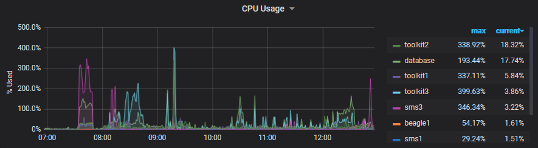
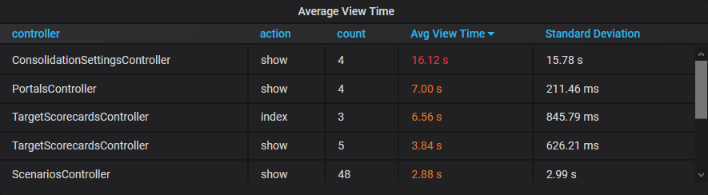
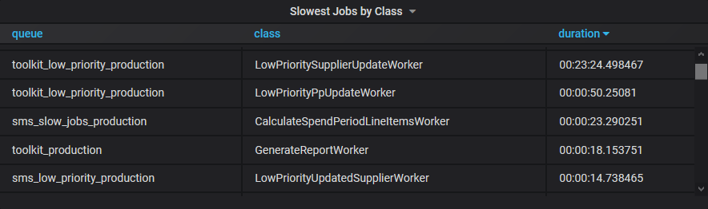

# Measuring Success

Over the past twenty years, I've had the privilege of working with many great
developers. A good developer can write testable and maintainable code that
allows the team to provide new features to customers. I believe a good developer
should also be a good engineer and one simple way we can begin to do is by
*measuring* the things we do!

While adding new functionality to an application is essential, it is also
critical that the system remains secure, performant, stable, and highly
available for its users. These qualities are not trivial to ensure, and even
experienced developers can accidentally slip up. Conversely, it is possible to
over-engineer solutions that slow the pace of new features for no measurable
improvement in quality. I decided to look for some ways of measuring parts of
our system to see if it could help us improve the way we build and maintain our
Web applications here at Mpowered.

We picked [Grafana](https://grafana.com) as our graphing tool which has native
support for PostgreSQL (using the [Timescale](https://www.timescale.com)
extension). While it works with many other
[time series databases](https://en.wikipedia.org/wiki/Time_series_database),
using a well supported relational database makes it easy to import data from any
platform that can connect to a Postgres database. Running ad-hoc SQL queries is
useful in discovering new patterns in our data that are then trivial to graph in
Grafana.

Our first phase involved measuring the easy stuff, namely system performance and
resource usage on the servers our applications run on. Seeing CPU, RAM, and disk
utilisation across multiple servers on a single graph highlighted interactions
between systems, and also helps us know when and how to upgrade our
infrastructure. Comparing average and peak usage helped us size key services
like our database and job queue workers. Looking ahead, we also hope to leverage
this data to dynamically scale up our infrastructure during busy times by
looking at long term trends as well as live performance data.

The second set of metrics we added were at the application level, tracking the
number of active web connections, the type and duration of web requests, and
similar information about our background jobs. We identified several places
where performance had once been adequate in the past, but, due to the increasing
size and complexity of data our customers work with today began to take longer
than we wanted. A detailed list of users and accounts with slow queries guided
us when generating sample data for testing. Measurements before and after we
improved our code helped confirmed the changes were performing as expected.
Profiling a running application this way has been invaluable in prioritising
work so that our team can focus on tackling the most pressing issues first.

Something I had not anticipated when comparing time-series databases to
Timescale was that the latter makes it possible to group metrics and update them
from different places in a distributed system with easy. Our job system, for
example, creates a measurement entry when first adding a job to the queue, and
our workers later update the start and completion times.

| job_id | enqueued_at         | started_at          | completed_at        |
| ------ | ------------------- | ------------------- | ------------------- |
| 5eaefc | 2020-05-06 13:10:52 | 2020-05-06 13:11:14 | 2020-05-06 13:12:15 |

This information allows us to track how long jobs sit in the various queues and
how long they take to complete. Tracking these durations helps inform us where
adding more workers in parallel is beneficial, or if we should investigate
making particular sections of code more performant.

Developers are also encouraged to add metrics, where possible, before
investigating bugs and performance-related issues. It's useful to demonstrate
where the current code is not running as intended and decide on a reasonable
target for which we consider a fix as "done". Once the measurements are in
place, Grafana allows us to place alerts to track these values going forward and
alert us if it's something we need to revisit in the future. As such, we
continue to add application metrics as our applications grow and mature.

The final set of metrics we're adding right now are project-related ones. We
track the number of bugs reported by [Honeybadger](https://app.honeybadger.io/)
to get a feel for long term trends and hope to use this information to guide our
development sprints. It would be interesting, for example, to see if there is an
increase in certain types of bugs on our staging environment after a big
feature-focussed push. By examining which class of errors we missed, we can
guide our code reviews and decide how better to catch them earlier during
automated testing.

Besides being a great tool to locate which areas of your code to focus on,
having tangible feedback is incredibly rewarding when completing a task and
seeing its positive impact on your system in production. Graphs and alerts can
be placed on a dashboard and displayed in the office to give a real-time view of
the environment that everyone can see. It was very encouraging to find
non-technical people take an interest in this data, in an easily digestible
format, which in turn stimulated other conversations about the inner workings of
our application.

After keeping our metrics open on a second monitor for a few weeks, I became so
accustomed to the baseline values that I was able almost sub-consciously to tell
when something out of the ordinary was happening! It has instilled greater
confidence when working with our system, and I feel it has already paid for
itself in terms of setup cost over the past few months. I can heartily recommend
this approach to anyone who doesn't already measure the things that are
important to them.